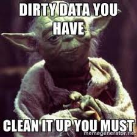

The datasets used in this course have been made available to you as R objects, specifically as data frames. The US murders data, the reported heights data, the Gapminder data, and the poll data are all examples. These datasets come included in the `dslabs` package and we can load them using the the `data` function. Furthermore, we have made the data available in what is referred to as `tidy` form, a concept we define later in this lecture. The _tidyverse_ packages and functions assume that the data is `tidy` and this assumption is a big part of the reason these packages work so well together. 

However, very rarely in a data science project is data easily available as part of a package. We did quite a bit of work "behind the scenes" to get the original raw data into the _tidy_ tables you will work with. Much more typical is for the data to be in a file, a database, or extracted from a document including web pages, tweets, or PDFs. In these cases, the the first step is to import the data into R and, when using the _tidyverse_, tidy the data. The first step in the data analysis process usually involves several, often complicated, steps to covert data from its raw form to the _tidy_ form that greatly facilitates the rest of the analysis. We refer to this process as `data wrangling`.

Here we cover several common steps of the data wrangling process including importing data into R from files, tidying data, string processing, html parsing, working with dates and times, and text mining. Rarely are all these wrangling steps necessary in a single analysis, but data scientists will likely face them all at some point. Some of the examples we use to demonstrate data wrangling techniques are based on the work we did to convert raw data into the the tidy datasets provided by the `dslabs` package and use in the course as examples.

<center>



</center>


## Tidy data

```{r, message=FALSE, warning=FALSE}
library(tidyverse)
library(dslabs)
ds_theme_set()
```

To help define tidy data we will use the Gapminder data from the `dslabs` package that contains the health and income outcomes for 184 countries from 1960 to 2016. This dataset comes from the [Gapminder Foundation](http://www.gapminder.org/), an organization dedicated to educating the public by using data to dispel common myths about the so-called "developing world". The organization uses data to show how actual trends in health and economics contradict the narratives that emanate from sensationalist media coverage of catastrophes, tragedies and other unfortunate events. We'll dig more into the data in the visualization module, but for now let's plot fertility data across time for two countries: South Korea and Germany. To make the plot we use this subset of the data:

```{r}
data("gapminder")
tidy_data <- gapminder %>% 
             filter(country %in% c("South Korea", "Germany")) %>%
             select(country, year, fertility)
head(tidy_data)
```

With the data in this format we could quickly make the desired plot:

```{r, warning=FALSE}
tidy_data %>% ggplot(aes(year, fertility, color = country)) +
              geom_point()
```

One reason this code works seamlessly is because the data is _tidy_: each point is represented in a row. This brings us to the definition of _tidy data_: each row represents one observation and the columns represent the different variables that we have data on for those observations.

If we go back to the original data provided by GapMinder we see that it does not start out _tidy_. We include an example file with the data shown in this graph mimicking the way it was originally saved in a spreadsheet:

```{r, message=FALSE}
path <- system.file("extdata", package="dslabs")
filename <- file.path(path,  "fertility-two-countries-example.csv")
wide_data <- read_csv(filename)
```

The object `wide_data` includes the same information as the object `tidy_data` except it is in a different format: a `wide` format. Here are the first nine columns:

```{r}
select(wide_data, country, `1960`:`1967`)
```

There are two important differences between the wide and tidy formats. First, in the wide format, each row includes several observations. Second, one of the variables, year, is stored in the header.
 
The `ggplot` code we introduced earlier no longer works here. For one there is no `year` variable. So to use the `tidyverse` we need to wrangle this data into `tidy` format.


## Data import

### Importing Spreadsheets

In the R module some of the basics of data import are covered. We described functions available in the default R installation. Here we present a more general discussion and introduce the `tidyverse` packages `readr` and `readxl`.

Currently, one of the most commons ways of storing and sharing data for analysis is through electronic spreadsheets. A spreadsheet stores data in rows and columns. It is basically a file version of a data frame. When saving such a table to a computer file one needs a way to define when a new row or column ends and the other begins. This in turn defines the cells in which single values are stored. 

When creating spreadsheets with text files, like the ones you can create with a simple text editor, a new row is defined with return and columns with some predefined special character. The most common characters are comma (`,`), semicolon (`;`), white space (\  ) and tab (\ \ \ \ ). 

You will also note that sometimes the first row contains column names rather than data. We call this a _header_ and when reading data from a spreadsheet it is important to know if the file has a header or not. Most reading functions assume there is a header. To know if the file has a header, it helps to look at the file before trying to read it. This can be done with a text editor or with RStudio. In RStudio we can do this by navigating to the file location, double clicking on the file and hitting _View File_.

However, not all spreadsheet files are text files. Google Sheets, which are rendered on a browser, are an example. Another example is the proprietary format used by Microsoft Excel. These can't be viewed with a text editor. Given the widespread use of Microsoft Excel software, this format is widely used. Although there are R packages designed to read this format, if you are choosing a file format to save your own data, you generally want to avoid Microsoft Excel. We recommend Google Sheets as a free software tool for organizing data.  

### Paths and the Working Directory

We start by demonstrating how to read in a file that is already saved on your computer. There are several ways to do this and we will discuss three of them. But you only need to learn one to follow along.

The first step is to find the file containing your data and know its location on your file system.

When you are working in R it is important to know your _working directory_. This is the directory in which R will save or look for files by default. You can see your working directory by typing:

```{r, eval=FALSE}
getwd()
```

You can change your working directory using the function `setwd`. If you are using RStudio, you can change it by clicking on _Session_.

One thing that file-reading functions have in common is that, **unless a full path is provided, they search for files in the working directory**. For this reason, our recommended approach for beginners is that you create a directory for each analysis and keep the raw data files in that directory. To keep raw data files organized, we recommend creating a `data` directory, especially when the project involves more than one data file.

Because you may not have a data file handy yet, we provide example data files in the `dslabs` package. Once you download and install the `dslabs` package, files will be in the external data (`extdata`) directory:

```{r}
system.file("extdata", package = "dslabs")
```

Note that the output of this function call will change depending on your operating system, how you installed R and the version of R. But it will be consistent within your system and you will be able to see the files included in this directory using the function `list.files`:

```{r}
path <- system.file("extdata", package = "dslabs")
list.files(path)
```

Now that we know the location of these files, we are ready to import them into R. To make the code simpler and following along easier, you can move this file to your working directory. You can do this through the file system directly, but you can also do it within R itself using the `file.copy` function. To do this it will help to define a variable with the full path using the function `file.path`. Using `paste` is not recommended since Microsoft Windows and Macs/Linux/Unix use different slashes for the paths. The function `file.path` is aware of your system and chooses the correct slashes. Here is an example:

```{r}
filename <- "murders.csv"
fullpath <- file.path(path, filename)
fullpath
```

You can now copy the file over to the working directory like this:

```{r}
file.copy(fullpath, getwd())
```

You can check if the file is now in your working directory using the `file.exists` function:

```{r}
file.exists(filename)
```

### The `readr` and `readxl` packages

Now we are ready to read in the file. `readr` is the `tidyverse` library that includes functions for reading data stored in text file spreadsheets into R. The following functions are available to read-in spreadsheets:

| Function | Format | Typical suffix |
|----------|--------|---| 
| read_table | white space separated values | txt |
| read_csv | comma separated values|  csv |
| read_csv2 | semicolon separated values | csv |
| read_tsv | tab delimited separated values | tsv |
| read_delim | general text file format, must define delimiter | txt |

The `readxl` package provides functions to read in Microsoft Excel formats:

| Function | Format | Typical suffix |
|----------|--------|---| 
| read_excel | auto detect the format | xls, xlsx|
| read_xls | original format |  xls |
| read_xlsx | new format | xlsx |


Note that the Microsoft Excel formats permit you to have more than one spreadsheet in one file. These are referred to as _sheets_. The functions above read the first sheet by default but the `excel_sheets` function gives us the names of the sheets in an excel file. These names can then be passed to the `sheet` argument in the three functions above to read sheets other than the first.

Note that the suffix usually tells us what type of file it is, but there is no guarantee that these always match. We can open the file to take a look or use the function `read_lines` to look at a few lines:

```{r}
read_lines("murders.csv", n_max = 3)
```

This also shows that there is a header. Now we are ready to read the data into R. From the suffix and the peek at the file we know to use `read_csv`:

```{r}
dat <- read_csv(filename)
```

We can also use the full path for the file:

```{r, eval=FALSE}
dat <- read_csv(fullpath)
```

Note that we receive a message letting us know what data types were used for each column. Also note that `dat` is a `tibble` with the content in the file:

```{r}
head(dat)
```

### R-base functions

R-base also provides import functions. These have similar names to those in the `tidyverse`: `read.table`, `read.csv` and `read.delim` for example. There are a couple of important differences. To show this we read the data with an R-base function:

```{r}
dat2 <- read.csv(filename)
```

One difference is that now we have a data frame and not a tibble:

```{r}
class(dat2)
```

The other difference is that the characters are converted to factors:

```{r}
class(dat2$abb)
class(dat2$region)
```

This can be avoided by setting the argument `stringsAsFactors` to FALSE.

### Downloading files

Another common place for data to reside is on the internet. When these are data files we can download them and then import them or even read them directly from the web. For example, we note that because our `dslabs` package is on GitHub, the file we downloaded with the package has a url.

```{r}
url <- "https://raw.githubusercontent.com/rafalab/dslabs/master/inst/extdata/murders.csv"
```

The `read_csv` file can read these files directly:

```{r}
dat <- read_csv(url)
```

If you want to have a local copy of the file, you can use `download.file`. 

```{r, eval=TRUE}
download.file(url, "murders.csv")
```

Two functions that are sometimes useful when downloading data from the internet is `tempdir` and `tempfile`. The first actually creates a directory with a name that is very likely to be unique. Similarly, `tempfile` creates a character string, not a file, that is likely to be a unique filename:

```{r}
tempfile()
```

So you can run commands like this which erases the temporary file once it imports the data:

```{r, eval=FALSE}
tmp_filename <- tempfile()
download.file(url, tmp_filename)
dat <- read_csv(tmp_filename)
file.remove(tmp_filename)
head(dat)
```


### Nuances

When reading in spreadsheets many things can go wrong. The file might have a multiline header, be missing cells, or it might use an unexpected [encoding]( https://en.wikipedia.org/wiki/Character_encoding). We recommend you read this [post](https://www.joelonsoftware.com/2003/10/08/the-absolute-minimum-every-software-developer-absolutely-positively-must-know-about-unicode-and-character-sets-no-excuses/). 

With experience you will learn how to deal with different challenges. Carefully reading the help files for the functions discussed here will help. Two other functions that are helpful are `scan` and `readLines`. With scan you can read in each cell of a file. Here is an example:

```{r}
x <- scan(filename, sep=",", what = "c")
x[1:10]
```


### Removing a file

Now that we are done with the example we will remove the example spreadsheet we copied over to our working directory using the function `file.remove`.

```{r}
file.remove(filename)
```


## Reshaping data

As we have seen, having data in `tidy` format is what makes the `tidyverse` flow. After the first step in the data analysis process, importing data, a common next step is to reshape the data into a form that facilitates the rest of the analysis. The `tidyr` package includes several functions that are useful for tidying data. 

### `gather`

One of the most used functions in this package is `gather`, which converts wide data into tidy data. Let's see a simple example with a subset of the gapminder data. Here we have annual fertility rates for Germany and Korea in wide format:

```{r, message=FALSE, warning=FALSE}
path      <- system.file("extdata", package="dslabs")
filename  <- file.path(path,  "fertility-two-countries-example.csv")
wide_data <- read_csv(filename)
head(wide_data)
```

Recall that the gapminder data we used had a column named `year` and a column named `fertility_rate`. We would like to convert this subset into that format. We will use the `gather` function for this.

In the third argument of the `gather` function you specify the columns that will be _gathered_. The default is to gather all columns, so in most cases we have to specify the columns. Here we want columns `1960`, `1961`, up to `2015`. The first argument sets the column/variable name that will hold the variable that is currently kept in the wide data column names. In our case it makes sense to set the name to `year`, but we can name it anything. The second argument sets the column/variable name that will hold the values in the column cells. In this case we call it `fertility` since this is what is stored in this file. Note that nowhere in this file does it tell us this is fertility data. Instead, this information was kept in the file name.  

The gathering code looks like this:

```{r}
new_tidy_data <- wide_data %>%
                 gather(year, fertility, `1960`:`2015`) 
```

We can see that the data have been converted to tidy format with columns `year` and `fertility`:

```{r}
head(new_tidy_data)
```

However, each year resulted in two rows since we have two countries and this column was not gathered.

A somewhat quicker way to write this code is to specify which column will **not** be gathered rather than all the columns that will be gathered:

```{r}
new_tidy_data <- wide_data %>%
                 gather(year, fertility, -country)
```

This data looks a lot like the original `tidy_data` we used. There is just one minor difference. Can you spot it? Look at the data type of the year column:

```{r}
data("gapminder")
tidy_data <- gapminder %>% 
             filter(country %in% c("South Korea", "Germany")) %>%
             select(country, year, fertility)

class(tidy_data$year)
class(new_tidy_data$year)
```

The `gather` function assumes that column names are characters. So we need a bit more wrangling before we are ready to make a plot. We need to convert the column to numbers. The `gather` function has an argument for that, the `convert` argument:

```{r}
new_tidy_data <- wide_data %>%
                 gather(year, fertility, -country, convert = TRUE)
class(new_tidy_data$year)
```

We could have also used the `mutate` and `as.numeric` functions.

Now that the data is tidy we can use the same ggplot as before:

```{r}
new_tidy_data %>% ggplot(aes(year, fertility, color = country)) +
  geom_point()
```

### `spread`

As we will see in later examples it is sometimes useful for data wrangling purposes to convert tidy data into wide data. We often use this as an intermediate step in tidying up data. The `spread` function is basically the inverse of `gather`. The first argument tells `spread` which variable will be used as the column names. The second argument specifies which variable to use to fill out the cells:

```{r}
new_wide_data <- new_tidy_data %>% spread(year, fertility)
                 select(new_wide_data, country, `1960`:`1967`)
```


### `separate`

The data wrangling shown above was simple compared to what is usually required. In our example spreadsheet files we include an example that is slightly more complicated. It includes two variables: life expectancy as well as fertility. However, the way it is stored is not tidy and, as we will explain, not optimal.

```{r, message=FALSE}
path     <- system.file("extdata", package = "dslabs")
filename <- file.path(path, "life-expectancy-and-fertility-two-countries-example.csv")

raw_dat <- read_csv(filename)
select(raw_dat, 1:5)
```

First note that the data is in wide format. Second, note that now there are values for two variables with the column names encoding which column represents which variable. We can start the data wrangling with the `gather` function, but we should no longer use the column name `year` for the new column since since it also contains the variable type. We will call it `key`, the default, for now:

```{r}
dat <- raw_dat %>% gather(key, value, -country)
head(dat)
```

The result is not exactly what we refer to as tidy since each observation is associated with two rows instead of one. We want to have the values from the two variables, fertility and life expectancy, in two separate columns. The first challenge to achieve this is to separate the `key` column into the year and the variable type. Note that the entries in this column separate the year from the variable name with an underscore: 

```{r}
dat$key[1:5]
```

Encoding multiple variables in a column name is such a common problem that the `readr` package includes a function to separate these columns into two or more. Apart from the data, the `separate` function takes three arguments: the name of the column to be separated, the names to be used for the new columns and the character that separates the variables. So a first attempt at this is:

```{r, eval=FALSE}
dat %>% separate(key, c("year", "variable_name"), "_")
```

Because "_" is the default separator we actually can simply write:

```{r}
dat %>% separate(key, c("year", "variable_name"))
```

However, we run into a problem. Note that we receive the warning `Too many values at 112 locations:` and that the `life_exepectancy` variable is truncated to `life`. This is because the `_` is used to separate `life` and `expectancy` not just year and variable name. We could add a third column to catch this and let the `separate` function know which column to _fill in_ with missing values, `NA`, when there is no third value. Here we tell it to fill the column on the right:

```{r}
dat %>% separate(key, 
                 c("year", "first_variable_name", "second_variable_name"), 
                 fill = "right")
```

However, if we read the `separate` help file we find that a better approach is to merge the last two variables when there is an extra separation:

```{r}
dat %>% separate(key, c("year", "variable_name"), sep = "_", extra = "merge")
```

This achieves the separation we wanted. However, we are not done yet. We need to create a column for each variable. As we learned, the `spread` function can do this:

```{r}
dat %>% separate(key, c("year", "variable_name"), sep = "_", extra = "merge") %>%
  			spread(variable_name, value) 
```

The data is now in tidy format with one row for each observation with three variables: `year`, `fertility` and `life expectancy`.

### `unite`

It is sometimes useful to do the inverse of `separate`, i.e. unite two columns into one. So, although this is *not* an optimal approach, had we used this command to separate: 

```{r}
dat %>% 
  separate(key, c("year", "first_variable_name", "second_variable_name"), fill = "right")
```

we can achieve the same final result by uniting the second and third column like this:

```{r}
dat %>% 
  separate(key, c("year", "first_variable_name", "second_variable_name"), fill = "right") %>%
  unite(variable_name, first_variable_name, second_variable_name, sep = "_")
```

Then spreading the columns:

```{r}
dat %>% 
  separate(key, c("year", "first_variable_name", "second_variable_name"), fill = "right") %>%
  unite(variable_name, first_variable_name, second_variable_name, sep = "_") %>%
  spread(variable_name, value) %>%
  rename(fertility = fertility_NA)
```


## Combining tables

```{r, message=FALSE, warning=FALSE}
library(ggrepel)
ds_theme_set()
```

The information we need for a given analysis may not be in just one table. Here we use a simple example to illustrate the general challenge of combining tables.

Suppose we want to explore the relationship between population size for US states, which we have in this table using the `murders` dataset from the `dslabs` package:

```{r}
data(murders)
head(murders)
```

and electoral votes (also from the `dslabs` package), which we have in this one:

```{r}
data(polls_us_election_2016)
head(results_us_election_2016)
```

Notice that just joining these two tables together will not work since the order of the states is not quite the same:

```{r}
identical(results_us_election_2016$state, murders$state)
```

The _join_ functions, described below, are designed to handle this challenge.

### Joins

The `join` functions in the `dplyr` package, which are based on SQL joins, make sure that the tables are combined so that matching rows are together.
The general idea is that one needs to identify one or more columns that will serve to match the two tables. Then a new table with the combined information is returned. Note what happens if we join the two tables above by `state` using `left_join`:

```{r}
tab <- left_join(murders, results_us_election_2016, by = "state")

tab %>% select(state, population, electoral_votes) %>% 
        head()
```

The data has been successfully joined and we can now, for example, make a plot to explore the relationship between population and electoral votes:

```{r}
tab %>% ggplot(aes(population/10^6, electoral_votes, label = abb)) +
        geom_point() +
        geom_text_repel() + 
        scale_x_continuous(trans = "log2") +
        scale_y_continuous(trans = "log2") +
        geom_smooth(method = "lm", se = FALSE) +
	      xlab("Population (in millions)") + 
	      ylab("Electoral Votes")
```

We see the relationship is close to linear with about 2 electoral votes for every million persons, but with smaller states getting a higher ratio.


In practice, it is not always the case that each row in one table has a matching row in the other. For this reason we have several different ways to join. To illustrate this challenge, take subsets of the matrices above:

```{r}
tab1 <- slice(murders, 1:6) %>% 
        select(state, population)
tab1
```

so that we no longer have the same states in the two tables:
```{r}
tab2 <- slice(results_us_election_2016, c(1:3, 5, 14, 44)) %>% 
        select(state, electoral_votes)
tab2
```

We will use these two tables as examples.

#### Left join

Suppose we want a table like `tab1` but adding electoral votes to whatever states we have available. For this we use left join with `tab1` as the first argument.

```{r}
left_join(tab1, tab2)
```

Note that `NA`s are added to the three states not appearing in `tab2`. Also note that this function, as well as all the other joins, can receive the first arguments through the pipe:

```{r}
tab1 %>% left_join(tab2)
```


#### Right join

If instead of a table like `tab1` we want one like `tab2` we can use `right_join`:

```{r}
tab1 %>% right_join(tab2)
```

Notice that now the NAs are in the column coming from `tab1`.

#### Inner join

If we want to keep only the rows that have information in both tables we use inner join. You can think of this an intersection:

```{r}
inner_join(tab1, tab2)
```

#### Full join

And if we want to keep all the rows, and fill the missing parts with NAs, we can use a full join. You can think of this as a union:

```{r}
full_join(tab1, tab2)
```

#### Semi join

The `semi_join` let's us keep the part of the first table for which we have information in the second. It does not add the columns of the second:

```{r}
semi_join(tab1, tab2)
```


#### Anti join

The function `anti_join` is the opposite of `semi_join`. It keeps the elements of the first table for which there is no information in the second:

```{r}
anti_join(tab1, tab2)
```

### Binding

Although we have yet to use it in this course, another common way in which datasets are combined is by _binding_ them. Unlike the join function, the binding functions do no try to match by a variable but rather just combine datasets. If the datasets don't match by the appropriate dimensions one obtains an error.

#### Columns

The `dplyr` function _bind_cols_ binds two objects by making them columns in a tibble. For example, if we quickly want to make a data frame consisting of numbers we can use.

```{r}
bind_cols(a = 1:3, b = 4:6)
```

This function requires that we assign names to the columns. Here we chose `a` and `b`. 

Note there is an R-base function `cbind` that performs the same function but creates objects other than tibbles. 

`bind_cols` can also bind data frames. For example, here we break up the `tab` data frame and then bind them back together:

```{r}
tab1 <- tab[, 1:3]
tab2 <- tab[, 4:6]
tab3 <- tab[, 7:9]
new_tab <- bind_cols(tab1, tab2, tab3)
head(new_tab)
```


#### Rows

The `bind_rows` is similar but binds rows instead of columns.

```{r}
tab1 <- tab[1:2,]
tab2 <- tab[3:4,]
bind_rows(tab1, tab2)
```

This is based on an R-base function `rbind`.

### Set Operators

Another set of commands useful for combing are the set operators. When applied to vectors, these behave as their names suggest. However, if the `tidyverse`, or more specifically, `dplyr` is loaded, these functions can be used on data frames as opposed to just on vectors.

#### Intersect

You can take intersections of vectors:

```{r}
intersect(1:10, 6:15)
```

```{r}
intersect(c("a","b","c"), c("b","c","d"))
```

But with `dplyr` loaded we can also do this for tables having the same column names:

```{r}
tab1 <- tab[1:5,]
tab2 <- tab[3:7,]
intersect(tab1, tab2)
```


#### Union

Similarly _union_ takes the union:

```{r}
union(1:10, 6:15)
```

```{r}
union(c("a","b","c"), c("b","c","d"))
```

But with `dplyr` loaded we can also do this for tables having the same column names:

```{r}
tab1 <- tab[1:5,]
tab2 <- tab[3:7,]
union(tab1, tab2)
```


#### Set differrence

The set difference between a first and second argument can be obtained with `setdiff`. Not unlike `instersect` and `union`, this function is not symmetric:


```{r}
setdiff(1:10, 6:15)
setdiff(6:15, 1:10)
```

As with the others above, we can apply it to data frames:
```{r}
tab1 <- tab[1:5,]
tab2 <- tab[3:7,]
setdiff(tab1, tab2)
```

#### `setequal`

Finally, the function `set_equal` tells us if two sets are the same, regardless of order. So

```{r}
setequal(1:5, 1:6)
```

but

```{r}
setequal(1:5, 5:1)
```

It also works when applied to data frames that are not equal regardless of order:

```{r}
setequal(tab1, tab2)
```


## Parsing Dates and Times

We have desribed three main types of vectors: numeric, character, and logical. In data science projects we very often encouter variables that are dates. Although we can represent a date with a string, for example, `November 19, 2018`, once we pick a reference day, referred to as the _epoch_, they can be converted to numbers. Computer languages usually use January 1, 1970 as the epoch. So November 19, 2018 is day 17,855. 

Now how should we represent dates and times when analyzing data in R? We could just use days since the epoch, but then it is almost impossible to interpret. If I tell you it's November 19, 2018, you know what this means immediately. If I tell you it's day 17,855, you will be quite confused. Similar problems arise with times. In this case it gets even more complicated due to time zones. 

For this reason R defines a data type just for dates and times. We can see an exmaple in the polls data:

```{r, message=FALSE, warning=FALSE}
data("polls_us_election_2016")
polls_us_election_2016$startdate %>% head
```

These look like strings. But they are not:

```{r}
class(polls_us_election_2016$startdate)
```

Look at what happens when we convert them to numbers:

```{r}
as.numeric(polls_us_election_2016$startdate) %>% head
```

It turns them into dates since the epoch. 

Plotting functions, such as those in ggplot, are aware of dates. This means that, for example, a scatter plot can use the numeric representation to decide on the position of the point, but include the string in the labels:

```{r}
polls_us_election_2016 %>% filter(pollster == "Ipsos" & state =="U.S.") %>%
  ggplot(aes(startdate, rawpoll_trump)) +
  geom_line()
```

Note in particular that the months are displayed. The tidyverse includes a functionality for dealing with dates through the `lubridate` package. 

```{r, message=FALSE, warning=FALSE}
library(lubridate)
```

We will take a random sample of dates to show some of the useful things one can do:
```{r}
set.seed(2)
dates <- sample(polls_us_election_2016$startdate, 10) %>% sort
dates
```

The functions `year`, `month` and `day` extract those values:

```{r}
data.frame(month = month(dates),
           day = day(dates),
           year = year(dates))
```

We can also extract the month labels:

```{r}
month(dates, label = TRUE)
```


Another useful set of functions are the _parsers_ that convert strings into dates.

```{r}
x <- c(20090101, "2009-01-02", "2009 01 03", "2009-1-4",
       "2009-1, 5", "Created on 2009 1 6", "200901 !!! 07")
ymd(x)
```


A further complication comes from the fact that dates often come in different formats in which the order of year month and day are different. The preferred format is to show year (with all four digits), month (two digits) and then day or what is called the ISO 8601. Specifically we use YYYY-MM-DD so that if we order the string it will be ordered by date. You can see the function `ymd` returns them in this format.

What if you encouter dates such as "09/01/02"? This could be September 1, 2002 or Janary 2, 2009 or January 9, 2002. 
In these cases examining the entire vector of dates will help you determine what format it is by process of elimination. Once you know, you can make use of the many parsers provided by lubridate.

For example, if the string is

```{r}
x <- "09/01/02"
```

The `ymd` function assumes the first entry is the year the second the month and the third the day so it coverts it to:

```{r}
ymd(x)
```

The `mdy` function assumes the first entry is the month then the day then the year:

```{r}
mdy(x)
```

Lubridate provides a function for every possibility:
```{r}
ydm(x)
myd(x)
dmy(x)
dym(x)
```


Lubridate is also useful for dealing with times. In R, you can get the current time by typing `Sys.time()`. Lubridate provides a slightly more advanced function, `now`, that permits you define the time zone:

```{r}
now()
now("GMT")
```

You can see all the available times zones with the `OlsonNames()` function.

Lubridate also has a function to extract hours, minutes and seconds:

```{r}
now() %>% hour()
now() %>% minute()
now() %>% second()
```

as well as a function to convert strings into times:

```{r}
x <- c("12:34:56")
hms(x)
```

as well as parsers for time objects that include dates:

```{r}
x <- "Nov/2/2012 12:34:56"
mdy_hms(x)
```
